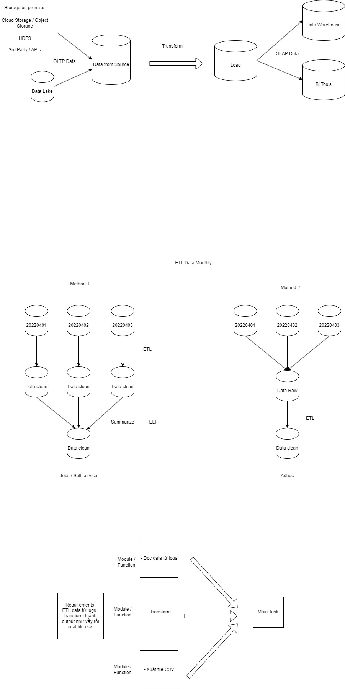
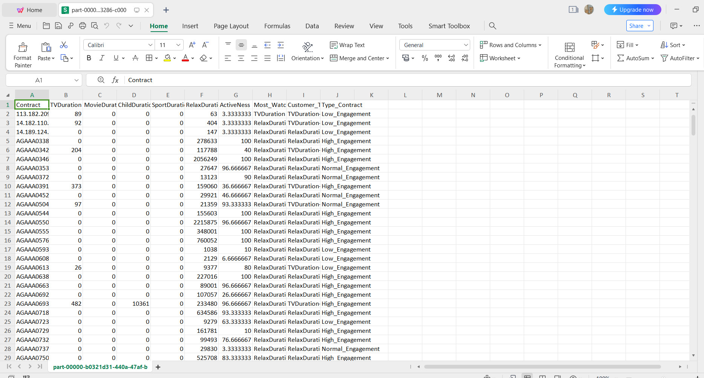
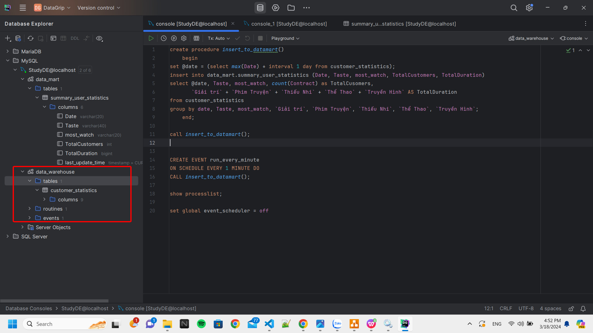
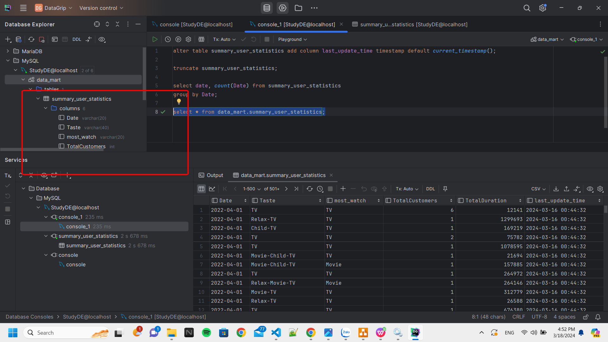

# Data pipeline
Bài tập thực hành về ETL VÀ ELT data

<h1 align="center">Hi 👋, I'm Vo Nguyen Thanh Tu</h1>

- ✍ I'm a student of: [Industrial University of Ho Chi Minh City](https://iuh.edu.vn/).
- ✍ Subject : Data Engineer
- ✍ Content: Thực hành về ETL VÀ ELT data

 

# 📒Hoạt độnng:
<table style="width:100%;">
  <tr>
    <td>
      
      
    </td>
    <td>
      
 
        
      

    </td>
  </tr>
</table>

# 📒Kĩ năng áp dụng trong Project :

  
  
  
  
  
  
  
  

# 📒Yêu cầu Project :

  Thực hành vê ETL VÀ ELT data

# 😍Trình bày về project:

  Sơ đồ mô phỏng về quá trình ETL và ELT data

 
# 🧑‍💻ETL data:

  - Thực hiện đọc data file .csv của 30 ngày

  - Sau đó tiến hành xử lý nó.

  - Xuất ra 1 file excel đã xử lý và lưu trữ nó vào 1 databases nào đó.

# 🧑‍💻ELT data:

  - Thực hiện import data từ file .csv đã được ETL ở trên vào data warehouse.

  - Sau đó tiến hành xử lý nó. Sử dụng T-SQL để viết các Produce cần thiết.

  - Mỗi khi thực thi Produce thì dữ liệu sẽ được tự động bắn vào Data Mart (Là nơi mà người dùng có thể trực tiếp xem data mà người dùng muốn chứ không thể xem được data ở Data Warehouse).

  - Dữ liệu đã được bắn và lưu vào Data mart.

